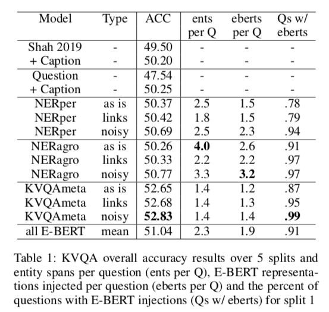
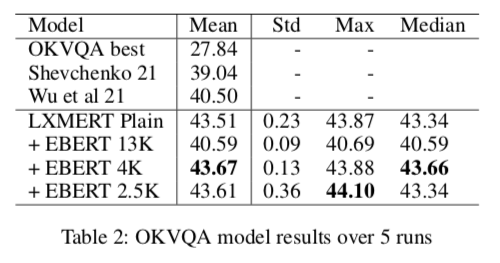

## Improving and Diagnosing Knowledge-Based Visual Question Answering via Entity Enhanced Knowledge Injection

<pre>
Knowledge-Based Visual Question Answering (KBVQA) is a bi-modal task requiring external world knowledge 
in order to correctly answer a text question and associated image. Recent single modality text work has 
shown knowledge injection into pre-trained language models, specifically entity enhanced knowledge graph 
embeddings, can improve performance on downstream entity-centric tasks.  In this work, we empirically 
study how and whether such methods, applied in a bi-modal setting, can improve an existing VQA system's 
performance on the KBVQA task.  We experiment with two large publicly available VQA datasets, (1) KVQA 
which contains mostly rare Wikipedia entities and (2) OKVQA which is less entity-centric and more aligned 
with common sense reasoning.  Both lack explicit entity spans and we study the effect of different weakly 
supervised and manual methods for obtaining them. Additionally we analyze how recently proposed bi-modal 
and single modal attention explanations are affected by the incorporation of such entity enhanced 
representations.  Our results show substantial improved performance on the KBVQA task without the need 
for additional costly pre-training and we provide insights for when entity knowledge injection helps 
improve a model's understanding.  
</pre>

<table><tr>
  <td></td>
  <td> </td>
  </tr></table>

## install dependencies
<pre>
1. make conda or virtualenv for project
2. install dependencies 
pip install -r requirements.txt
</pre>

## download data/models 
<pre>
# as per LXMERT codebase (https://github.com/airsplay/lxmert)  get their pre-trained model 
mkdir -p snap/pretrained 
wget https://nlp.cs.unc.edu/data/model_LXRT.pth -P snap/pretrained

# download data 
See OKVQA and KVQA websites respectively
# OKVQA - https://okvqa.allenai.org/download.html
# KVQA - http://malllabiisc.github.io/resources/kvqa/
</pre>

## set paths for KVQA and OKVQA
<pre>
for training models set to paths to downloaded data in the following for KVQA  
  1. src/tasks/kvqa_data.py   ( KVQA_DATA_ROOT , KVQA_IMGFEAT_ROOT, abs_path )
  2. src/pretrain/qa_answer_table.py     ( abs_path ) 
  3. src/lxrt/entry.py     ( DATA_RESOURCE_DIR  )
  
for evaluating models in integrated Bi-Modal attention explanation system, ( i refer to this as the integrated way) set the following paths.
  1. Transformer-MM-Explainability-main/lxmert/lxmert/perturb_kvqa.py ( KVQA_VAL_PATH, KVQA_IMGFEAT_ROOT, KVQA_URL, load_lxmert_qa_hf)
  2. Transformer-MM-Explainability-main/lxmert/lxmert/src/lxmert_lrp_ebert.py  (  def load(cls, path), DATA_RESOURCE_DIR )
  3. Transformer-MM-Explainability-main/lxmert/lxmert/src/tasks/kvqa_data.py   ( KVQA_DATA_ROOT, KVQA_IMGFEAT_ROOT, abs_path )
  
# FOR OKVQA set the following:
  1. src/tasks/okvqa_data.py   ( OKVQA_DATA_ROOT , OKVQA_IMGFEAT_ROOT, abs_path )
  2. src/pretrain/qa_answer_table.py     ( abs_path ) 
  3. src/lxrt/entry.py     ( DATA_RESOURCE_DIR  )
  
for evaluating models in integrated Bi-Modal attention explanation system,  set the following paths.
  1. Transformer-MM-Explainability-main/lxmert/lxmert/perturb_okvqa.py ( OKVQA_VAL_PATH, OKVQA_IMGFEAT_ROOT, OKVQA_URL, load_lxmert_qa_hf)
  2. Transformer-MM-Explainability-main/lxmert/lxmert/src/lxmert_lrp_ebert.py  (  def load(cls, path), DATA_RESOURCE_DIR )
  3. Transformer-MM-Explainability-main/lxmert/lxmert/src/tasks/kvqa_data.py   ( OKVQA_DATA_ROOT, OKVQA_IMGFEAT_ROOT, abs_path )
</pre>

## to train / test models on KVQA 
<pre>

There are 5 types of input sets you can finetune LXMERT with
1) plain Question, 
2) Question with captions, 
3) NERper ( yasu2 ) 
4) NERagro ( sep13_3few )
5) KVQAmeta ( oracle ) 
The final three use the input format of 2), but with additioanl E-BERT knowledge injection based on the entity sets provided.  
You can specify what type of entity set linking to use ( "plain", "link", "noisy") for the E-BERT methods as well.
The --ent_set parameter defines which E-BERT model/linktype to use
              [ None, "oracle_links",       "oracle_noisy",     <-- KVQAmeta (as is, links, noisy)
           "sep13_3", "sept13_fewkb_links", "sept13_fewkb",     <--- NERagro (as is, links, noisy)
             "yasu2", "yasu2links",         "yasu2noisy"]       <--- NERper (as is, links, noisy)

KVQA has 5 data splits to choose from [0 - 4] )
#Example calls running from root below:

# finetune on KVQA split 4 ( on GPU 1 ) plain Question
bash run/kvqa_finetune.bash 1 kvqa_plain_sp4 4
# and test model
bash run/kvqa_test.bash 1 kvqa_plain_sp4_results 4 --test test_kvqa --load snap/kvqa/kvqa_plain_sp4_4/BEST

# finetune on KVQA split 0 ( on GPU 3 ) Question with captions 
bash run/kvqa_finetune.bash 3 kvqa_capt_sp0 0  --incl_caption --max_len 100
# and test model
bash run/kvqa_test.bash 3 kvqa_capt_sp0_results 0 --incl_caption --max_len 100 --test test_kvqa --load snap/kvqa/kvqa_capt_sp0_0/BEST

# finetune on KVQA split 3 ( on GPU 2 ) with EBERT ( defaults to KVQAmeta "as is" )
bash run/kvqa_finetune.bash 2 kvqa_ebert_sp3 3  --use_lm ebert --max_len 100
# and test model
bash run/kvqa_test.bash 2 kvqa_ebert_sp3_results 3 --use_lm ebert --max_len 100 --test test_kvqa --load snap/kvqa/kvqa_ebert_sp3_3/BEST

# finetune on KVQA split 0 ( on GPU 2 ) with EBERT NERper with noisy linktype 
bash run/kvqa_finetune.bash 2 kvqa_ebert_nerper_noisy_sp3 3  --use_lm ebert --ent_set yasu2noisy --max_len 100
# and test model
bash run/kvqa_test.bash 2 kvqa_ebert_nerper_noisy_sp3_results 3 --use_lm ebert --ent_set yasu2noisy --max_len 100 --test test_kvqa --load snap/kvqa/kvqa_ebert_nerper_noisy_sp3_3/BEST

</pre>

## for evaluating finetuned models with explanations from integrated Bi-Modal attention explanation system 
<pre>
# code base that I expanded is originally from ( https://github.com/hila-chefer/Transformer-MM-Explainability )
# the parameters to use are most identical to that of training

cd Transformer-Explainability
# standard KVQA on data split 0 
CUDA_VISIBLE_DEVICES=1 PYTHONPATH=`pwd` python lxmert/lxmert/perturbation_kvqa.py --split_num 0 --test test_kvqa --load /home/diego/adv_comp_viz21/lxmert/orig_code/lxmert/snap/kvqa/kvqa_plain_sp0_0/BEST --pred_out experiments/kvqa_plain_0_830.json
                --> Done. Elapsed: 878.91 ( 15 minutes )
                --> top1/top5 Acc/Raw: [47.27, 66.79, 8838, 12487, 18697]

# KVQA data with captions ( split 0 )
CUDA_VISIBLE_DEVICES=0 PYTHONPATH=`pwd` python lxmert/lxmert/perturbation_kvqa.py --num-samples=0 --incl_caption  --method ours_no_lrp --is-text-pert true --is-positive-pert true --split_num 0 --test test_kvqa --load /home/diego/adv_comp_viz21/lxmert/orig_code/lxmert/snap/kvqa/kvqa_capt_sp0_0/BEST --pred_out experiments/kvqa_capt_0_830.json
                --> Done. Elapsed: 1727.004583120346 ( 20 minutes )
                --> top1/top5 Acc/Raw: [48.82, 67.36, 9128, 12595, 18697]

# KVQA data with entity enhanced EBERT reps using NERagro as is
CUDA_VISIBLE_DEVICES=0 PYTHONPATH=`pwd` python lxmert/lxmert/perturbation_kvqa.py --use_lm ebert --ent_set sep13_3 --split_num 0 --test test_kvqa --load ../snap/kvqa/kvqa_sep13_3span_0v5_0/BEST --pred_out experiments/kvqa_ebert_0_sep13_3.json

</pre>

## Finetune/Test/Get Explainations for OKVQA
<pre>
#Same params as KVQA except ent_set is in [ None, 4k, 2p5k ]  #defaults to 13k 

# Example  finetune OKVQA on questions without knowledge injection, test and get explanations
bash run/okvqa_finetune.bash 3 okvqa_plain_0913_10epsR4 --max_len 50
bash run/okvqa_test.bash 3 okvqa_plain_0913_10eps_resR4 --max_len 50 --test test_tv --load snap/okvqa/okvqa_plain_0913_10epsR4/LAST
CUDA_VISIBLE_DEVICES=2 PYTHONPATH=`pwd` python lxmert/lxmert/perturbation_okvqa.py --test val --load /home/diego/adv_comp_viz21/lxmert/orig_code/lxmert_gen/snap/okvqa/okvqa_plain_0913_10epsR4/LAST  --pred_out experiments/okvqa_ebert_0913_10epsR4.json
 
# Example: finetune OKVQA on GPU 3 using E-BERT and 13k ent set, test and get explanations
bash run/okvqa_finetune.bash 3 okvqa_ebert_13k_0918 --use_lm ebert --max_len 50 
bash run/okvqa_test.bash 3 okvqa_ebert_13k_0918_results --use_lm ebert --max_len 50 --test test_tv --load snap/okvqa/okvqa_ebert_13k_0918/LAST
CUDA_VISIBLE_DEVICES=2 PYTHONPATH=`pwd` python lxmert/lxmert/perturbation_okvqa.py --use_lm ebert  --test val --load /home/diego/adv_comp_viz21/lxmert/orig_code/lxmert_gen/snap/okvqa/okvqa_ebert_13k_0918/LAST  --pred_out experiments/okvqa_ebert_13k_0918.json

# Example: finetune OKVQA on GPU 2 using E-BERT and 4k ent set, test and get explanations
bash run/okvqa_finetune.bash 2 okvqa_ebert_4k_0918 --use_lm ebert --ent_set 4k --max_len 50
bash run/okvqa_test.bash 2 okvqa_ebert_4k_0918_results --use_lm ebert --ent_set 4k  --max_len 50 --test test_tv --load snap/okvqa/okvqa_ebert_4k_0918/LAST
CUDA_VISIBLE_DEVICES=2 PYTHONPATH=`pwd` python lxmert/lxmert/perturbation_okvqa.py --use_lm ebert  --ent_set 4k  --test val --load /home/diego/adv_comp_viz21/lxmert/orig_code/lxmert_gen/snap/okvqa/okvqa_ebert_4k_0918/LAST  --pred_out experiments/okvqa_ebert_4k_0918.json

</pre>

# 2 notebooks used for analysis of KVQA and OK-VQA tasks
<pre>
# Note these two notebooks need to be cleaned up
notebooks/kvqa_streamed.ipynb
notebooks/okvqa_automated_metrics.ipynb
</pre>

### We'll will put up all datafiles soon!

